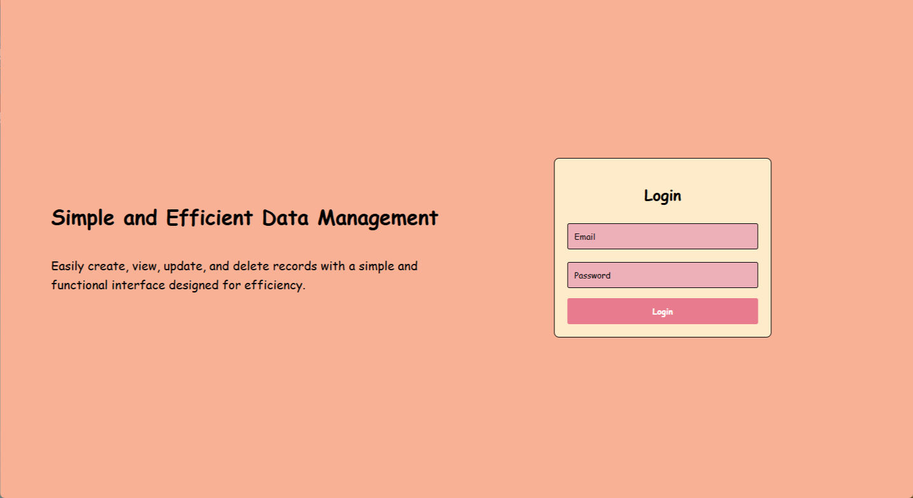
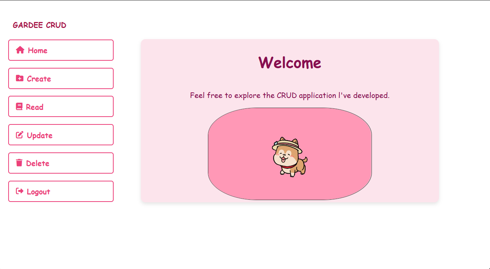
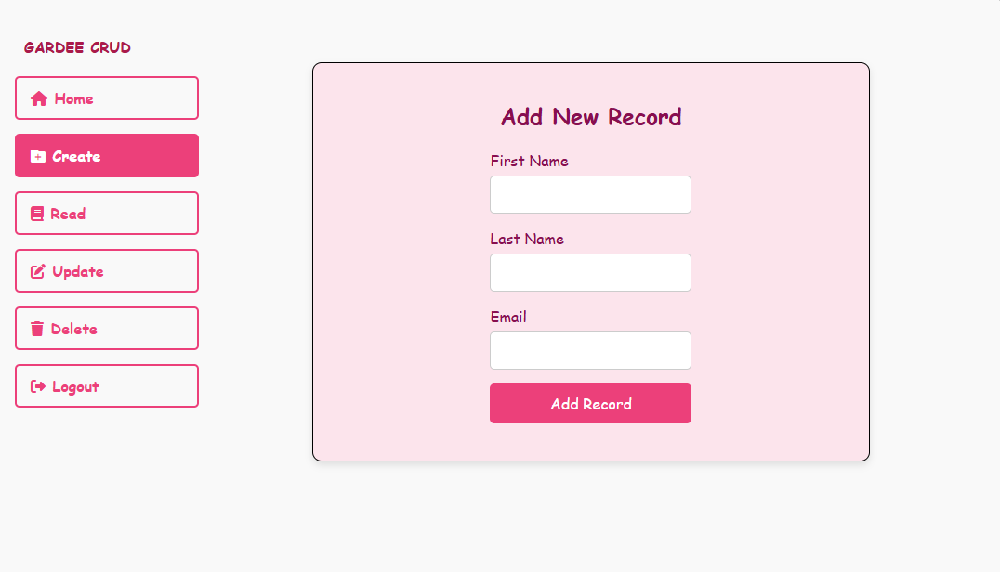
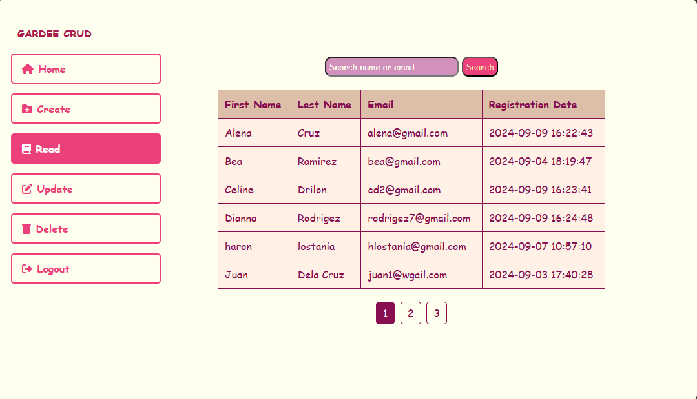
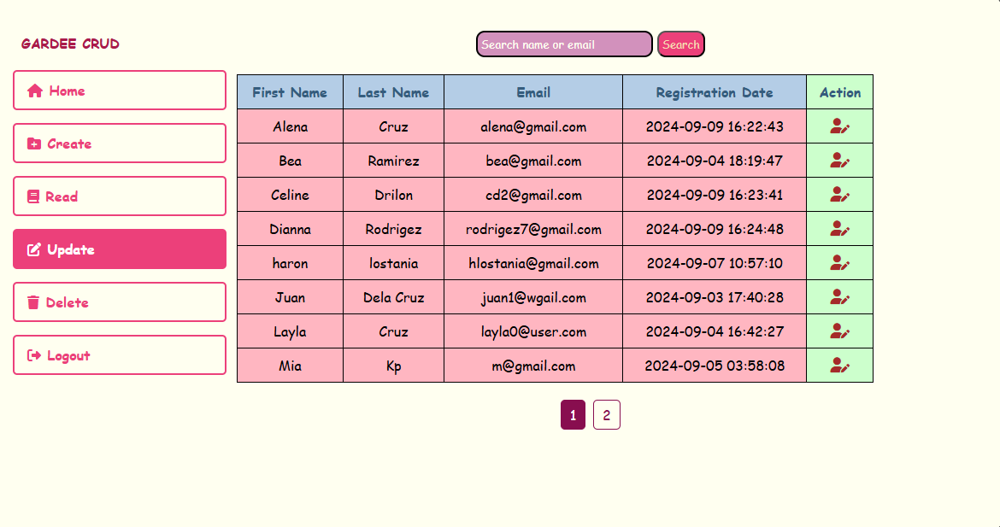
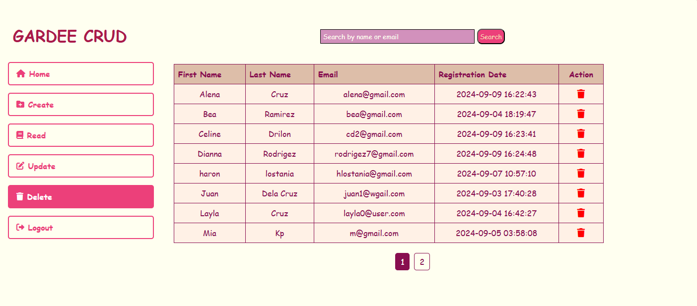

# SECOND YEAR FIRST SEM - CRUD APPLICATION

## Overview
A PHP-based CRUD (Create, Read, Update, Delete) application that interacts with a MySQL database to manage records efficiently.

## Features
- *Search*: Instantly locate records, such as resident details, using keyword-based search.
- *Pagination*: Breaks down large datasets into pages for easy navigation and improved performance.
- *Responsive Design*: Ensures compatibility across mobile, tablet, and desktop devices for an optimal user experience.
- *Error Handling*: Provides clear feedback for invalid or incomplete data submissions.
- *Alphabetical Sorting*: Automatically organizes records alphabetically for easy browsing.

---

## Pages

### 1. Login

### 2. Dashboard

### 3. Create Record

### 4. View Records

### 5. Update Record

### 6. Delete Record

---

## Technologies Used
- PHP
- MySQL
- HTML/CSS
- JavaScript

## Setup Instructions
1. Download the repository.
2. Import the provided SQL file to set up the database.
3. Access the application via your browser.
